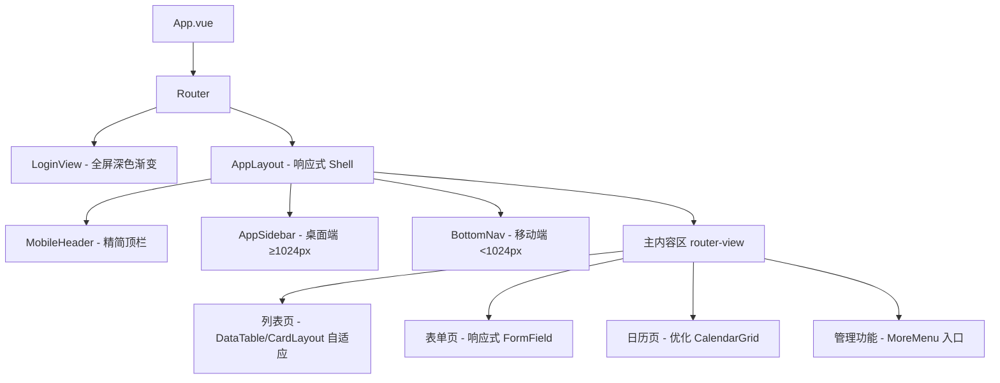

# 设计文档：移动端 UI 重新设计

## 概述

本设计文档描述 Villa PMS 前端从桌面优先到移动优先的 UI 改造方案。改造范围覆盖应用布局框架、导航系统、列表展示、日历视图、表单体验、交互模式和视觉设计等方面。

当前系统基于 Vue 3 + Vite 构建，使用自定义 CSS（无 UI 框架），本次改造将延续这一技术路线，通过引入 CSS 自定义属性（Design Tokens）、响应式断点体系和新的移动端组件来实现目标。

核心设计原则：
- 移动优先：所有样式从 375px 起设计，通过 `min-width` 媒体查询向上适配
- 渐进增强：桌面端在移动端基础上增加侧边栏、表格视图等增强体验
- 最小侵入：尽量复用现有组件接口，通过新增 props 和 CSS 响应式实现适配
- 无 UI 框架依赖：继续使用自定义 CSS，但引入 Design Token 系统统一管理

## 架构

### 整体架构变更



### 响应式断点体系

| 断点名称 | 宽度范围 | 布局策略 |
|---------|---------|---------|
| mobile | < 640px | 单列布局，卡片列表，收起筛选器，FAB 显示 |
| tablet | 640px - 767px | 单列布局，部分双列表单 |
| tablet-lg | 768px - 1023px | 表格视图，筛选器展开，FAB 隐藏 |
| desktop | ≥ 1024px | 侧边栏导航，完整桌面布局 |

### 文件结构变更

```
client/src/
├── assets/styles/
│   ├── main.css              # 现有 → 重构为移动优先
│   └── tokens.css            # 新增：Design Token 变量
├── components/
│   ├── layout/
│   │   ├── AppLayout.vue     # 改造：加入 BottomNav + 响应式
│   │   ├── AppHeader.vue     # 改造：精简为移动端顶栏
│   │   ├── AppSidebar.vue    # 改造：仅桌面端显示
│   │   └── BottomNav.vue     # 新增：底部标签导航
│   ├── common/
│   │   ├── DataTable.vue     # 改造：加入 CardLayout 模式
│   │   ├── FormField.vue     # 改造：增大触控区域
│   │   ├── ToastNotification.vue  # 改造：移动端全宽顶部
│   │   ├── ConfirmDialog.vue      # 改造：移动端底部面板
│   │   ├── FloatingActionButton.vue  # 新增：FAB 组件
│   │   ├── PullToRefresh.vue      # 新增：下拉刷新
│   │   └── MobileFilter.vue       # 新增：移动端筛选器
│   ├── calendar/
│   │   ├── CalendarGrid.vue       # 改造：固定列 + 触控优化
│   │   └── BookingPopover.vue     # 改造：移动端底部抽屉
│   └── icons/
│       └── SvgIcon.vue            # 新增：SVG 图标组件
├── composables/
│   ├── usePullToRefresh.js        # 新增：下拉刷新逻辑
│   ├── useInfiniteScroll.js       # 新增：无限滚动逻辑
│   └── useMediaQuery.js           # 新增：响应式断点检测
├── views/
│   └── MoreMenuView.vue           # 新增：管理功能菜单页
```

## 组件与接口

### 1. BottomNav 底部导航组件

```vue
<!-- BottomNav.vue -->
<script setup>
defineProps({
  items: Array,       // [{ to, icon, label, badge? }]
  activeRoute: String
})
</script>
```

行为：
- 固定在视口底部，深色背景（`var(--color-nav-bg)`）
- 每个标签项包含 SVG 图标 + 中文标签，高度 ≥ 48px，图标 24px
- 普通用户显示 4 个标签：日历、预订、工单、个人
- 管理员显示 5 个标签：日历、预订、工单、个人、更多
- 仅在 `< 1024px` 时显示，`≥ 1024px` 隐藏

### 2. AppLayout 改造

```vue
<!-- AppLayout.vue 改造后 -->
<template>
  <div class="app-layout">
    <AppSidebar v-if="isDesktop" />
    <div class="app-main">
      <AppHeader />
      <main class="app-content">
        <router-view />
      </main>
    </div>
    <BottomNav v-if="!isDesktop" :items="navItems" />
  </div>
</template>
```

变更点：
- 使用 `useMediaQuery` composable 检测 `isDesktop`（≥ 1024px）
- 移动端隐藏 Sidebar，显示 BottomNav
- 主内容区底部增加 padding 避免被 BottomNav 遮挡
- AppHeader 精简：移除汉堡菜单按钮（移动端不再需要），仅保留页面标题 + 语言切换

### 3. DataTable 卡片模式改造

```vue
<!-- DataTable.vue 新增 props -->
<script setup>
defineProps({
  // ...现有 props
  cardMode: Boolean,           // 是否启用卡片模式（由父组件根据断点传入）
  cardTitleKey: String,        // 卡片标题字段 key
  cardSubtitleKey: String,     // 卡片副标题字段 key
  cardStatusKey: String,       // 状态字段 key
  cardLinkFn: Function,        // 点击跳转路由生成函数
})
</script>
```

行为：
- `cardMode=true` 时渲染为卡片列表，每张卡片突出主要信息
- `cardMode=false` 时保持现有表格渲染
- 父组件（如 BookingListView）通过 `useMediaQuery` 判断 `< 768px` 时传入 `cardMode=true`

### 4. FloatingActionButton (FAB)

```vue
<script setup>
defineProps({
  to: String,     // 路由目标
  icon: String,   // 图标名称，默认 'plus'
  label: String   // 无障碍标签
})
</script>
```

行为：
- 56px 圆形按钮，主色调背景，白色加号图标
- 固定定位右下角，距底部导航栏上方 16px
- 仅在 `< 768px` 时显示

### 5. MobileFilter 移动端筛选器

```vue
<script setup>
defineProps({
  filters: Object,        // 当前筛选条件
  filterFields: Array,    // 筛选字段定义
  activeCount: Number     // 激活的筛选条件数量
})
defineEmits(['apply', 'reset'])
</script>
```

行为：
- `< 768px`：显示为"筛选"按钮 + 角标数字，点击展开底部抽屉面板
- `≥ 768px`：直接渲染为水平排列的筛选栏（保持现有样式）
- 底部抽屉包含所有筛选选项 + "应用"/"重置"按钮

### 6. PullToRefresh 下拉刷新

```vue
<script setup>
defineProps({
  loading: Boolean,
  disabled: Boolean
})
defineEmits(['refresh'])
</script>
```

行为：
- 包裹列表内容，监听触摸下拉手势
- 下拉超过阈值（60px）后释放触发 refresh 事件
- 显示旋转加载指示器动画

### 7. useInfiniteScroll composable

```js
export function useInfiniteScroll(options) {
  // options: { loadMore: Function, hasMore: Ref<boolean>, threshold: number }
  // 返回: { containerRef }
}
```

行为：
- 监听滚动容器，距底部 threshold（默认 200px）时触发 loadMore
- hasMore 为 false 时停止监听
- 配合列表页的分页 store 使用

### 8. BookingPopover 移动端改造

变更点：
- `< 768px` 时以底部抽屉（bottom sheet）形式呈现，从底部滑入
- `≥ 768px` 时保持现有的绝对定位弹出层
- 底部抽屉模式下宽度 100%，圆角仅在顶部

### 9. SvgIcon 图标组件

```vue
<script setup>
defineProps({
  name: { type: String, required: true },
  size: { type: [Number, String], default: 24 }
})
</script>
```

设计决策：使用内联 SVG sprite 方案而非安装第三方图标库。原因：
- 项目仅需约 20-30 个图标，不需要完整图标库的体积开销
- 创建一个 SVG sprite 文件包含所有需要的图标（从 Material Design Icons 提取）
- 通过 `<use href="#icon-name">` 引用，零运行时依赖

需要的图标清单：
`calendar`, `booking`, `ticket`, `person`, `more`, `plus`, `edit`, `delete`, `save`, `filter`, `chevron-up`, `chevron-down`, `chevron-left`, `chevron-right`, `check`, `close`, `clock`, `warning`, `error`, `success`, `search`, `refresh`, `room`, `report`, `config`, `users`

### 10. MoreMenuView 管理功能菜单

```vue
<!-- 管理员"更多"页面 -->
<template>
  <div class="more-menu">
    <div class="menu-grid">
      <router-link v-for="item in menuItems" :to="item.to" class="menu-item">
        <SvgIcon :name="item.icon" :size="32" />
        <span>{{ item.label }}</span>
      </router-link>
    </div>
  </div>
</template>
```

行为：
- 2×2 网格布局，每个入口包含图标 + 中文标签
- 包含：房间管理、报表、系统配置、用户管理
- 仅管理员可访问

## 数据模型

### Design Token 系统 (tokens.css)

```css
:root {
  /* 颜色 */
  --color-primary: #2563eb;
  --color-primary-hover: #1d4ed8;
  --color-primary-light: #dbeafe;
  --color-danger: #ef4444;
  --color-danger-hover: #dc2626;
  --color-success: #059669;
  --color-warning: #d97706;
  --color-nav-bg: #1a1a2e;
  --color-nav-text: rgba(255, 255, 255, 0.7);
  --color-nav-active: #ffffff;
  --color-bg: #f3f4f6;
  --color-surface: #ffffff;
  --color-border: #e5e7eb;
  --color-border-light: #f3f4f6;
  --color-text-primary: #111827;
  --color-text-secondary: #374151;
  --color-text-muted: #6b7280;
  --color-text-placeholder: #9ca3af;

  /* 字号 */
  --font-size-xs: 0.75rem;
  --font-size-sm: 0.8125rem;
  --font-size-base: 1rem;
  --font-size-lg: 1.125rem;
  --font-size-xl: 1.375rem;
  --font-size-2xl: 1.5rem;

  /* 间距 */
  --spacing-xs: 0.25rem;
  --spacing-sm: 0.5rem;
  --spacing-md: 1rem;
  --spacing-lg: 1.5rem;
  --spacing-xl: 2rem;

  /* 圆角 */
  --radius-sm: 6px;
  --radius-md: 8px;
  --radius-lg: 12px;
  --radius-full: 9999px;

  /* 阴影 */
  --shadow-sm: 0 1px 3px rgba(0, 0, 0, 0.1);
  --shadow-md: 0 4px 12px rgba(0, 0, 0, 0.1);
  --shadow-lg: 0 4px 24px rgba(0, 0, 0, 0.15);

  /* 触控 */
  --touch-target-min: 44px;
  --touch-target-nav: 48px;
  --fab-size: 56px;

  /* 动画 */
  --transition-fast: 150ms ease;
  --transition-normal: 200ms ease;
  --transition-slow: 300ms ease;

  /* 底部导航高度 */
  --bottom-nav-height: 56px;
}
```

### 路由变更

新增路由：
```js
{ path: 'more', name: 'MoreMenu', component: () => import('../views/MoreMenuView.vue'), meta: { role: 'Admin' } }
```

### Store 变更

列表页 store（booking, ticket）需要支持无限滚动模式：
- 新增 `appendMode` 标志：为 true 时 fetchBookings 将结果追加到现有列表而非替换
- 新增 `hasMore` computed：`page < totalPages`
- 新增 `loadNextPage` action：page++ 后以 appendMode 获取数据

```js
// booking store 新增
const appendMode = ref(false);

async function fetchBookings() {
  loading.value = true;
  try {
    // ...现有逻辑
    if (appendMode.value) {
      bookings.value = [...bookings.value, ...data.data];
    } else {
      bookings.value = data.data;
    }
    // ...
  }
}

function loadNextPage() {
  if (page.value < totalPages.value) {
    page.value++;
    appendMode.value = true;
    fetchBookings().finally(() => { appendMode.value = false; });
  }
}

const hasMore = computed(() => page.value < totalPages.value);
```


## 正确性属性

*属性（Property）是指在系统所有有效执行中都应保持为真的特征或行为——本质上是关于系统应该做什么的形式化陈述。属性是人类可读规范与机器可验证正确性保证之间的桥梁。*

### Property 1: 响应式导航切换

*For any* 屏幕宽度，当宽度 < 1024px 时 BottomNav 可见且 Sidebar 隐藏，当宽度 ≥ 1024px 时 Sidebar 可见且 BottomNav 隐藏。

**Validates: Requirements 1.2, 1.3**

### Property 2: BottomNav 标签项基于用户角色

*For any* 用户角色，当角色为 Admin 时 BottomNav 显示 5 个标签项（含"更多"），当角色非 Admin 时显示 4 个标签项（不含"更多"）。

**Validates: Requirements 1.4, 12.1, 12.4**

### Property 3: BottomNav 标签项内容完整性

*For any* BottomNav 标签项，该项必须同时包含一个 SVG 图标元素和一个文字标签元素。

**Validates: Requirements 1.5, 3.2**

### Property 4: 触控目标最小尺寸

*For any* 可交互元素（按钮、链接、导航项、选择框），其渲染后的触控区域宽度和高度均不小于 44px。

**Validates: Requirements 2.1, 5.5**

### Property 5: 文字尺寸下限

*For any* 正文文字元素，其 font-size 不小于 1rem（16px）；*For any* 页面标题元素，其 font-size 不小于 1.375rem（22px）。

**Validates: Requirements 2.2, 2.3**

### Property 6: 按钮内边距下限

*For any* 按钮元素，其垂直内边距不小于 0.75rem，水平内边距不小于 1.25rem。

**Validates: Requirements 2.4**

### Property 7: Status_Badge 尺寸与图标

*For any* Status_Badge 元素，其 font-size 不小于 0.8125rem，内边距不小于 0.25rem 0.75rem，且包含对应状态的图标元素。

**Validates: Requirements 2.5, 3.4**

### Property 8: BottomNav 标签项尺寸

*For any* BottomNav 标签项，其高度不小于 48px，图标尺寸不小于 24px，标签文字 font-size 不小于 0.75rem。

**Validates: Requirements 2.6**

### Property 9: 主要操作按钮包含图标

*For any* 主要操作按钮（新建、保存、删除、编辑），其渲染内容必须同时包含图标元素和文字。

**Validates: Requirements 3.3**

### Property 10: DataTable 响应式渲染模式

*For any* 屏幕宽度，当宽度 < 768px 时 DataTable 以卡片模式渲染，当宽度 ≥ 768px 时以表格模式渲染。

**Validates: Requirements 4.1, 4.2**

### Property 11: 卡片布局信息层次

*For any* Card_Layout 中的卡片，主要信息（标题）的 font-size 大于次要信息（日期、金额等）的 font-size，且卡片包含 Status_Badge。

**Validates: Requirements 4.3, 4.4**

### Property 12: 卡片点击导航

*For any* Card_Layout 中的卡片，点击该卡片应导航到对应记录的详情页路由。

**Validates: Requirements 4.5**

### Property 13: 日历预订条尺寸

*For any* CalendarGrid 中渲染的预订条，其高度不小于 36px，客人姓名文字 font-size 不小于 0.75rem。

**Validates: Requirements 5.3**

### Property 14: 预订详情移动端底部抽屉

*For any* 屏幕宽度 < 768px 时的预订条点击事件，BookingPopover 以底部抽屉模式渲染（从底部滑入，宽度 100%）。

**Validates: Requirements 5.4**

### Property 15: 日历日期列头信息

*For any* CalendarGrid 的日期列头，必须同时显示日期数字和星期缩写。

**Validates: Requirements 5.6**

### Property 16: 卡片圆角与阴影

*For any* 卡片元素，其 border-radius 不小于 12px，且具有 box-shadow 样式。

**Validates: Requirements 6.3**

### Property 17: 表单输入框圆角

*For any* 表单输入框（input, select, textarea），其 border-radius 不小于 8px。

**Validates: Requirements 6.6**

### Property 18: FormField 输入框高度

*For any* FormField 中的输入框和选择框，其高度不小于 48px。

**Validates: Requirements 7.1**

### Property 19: FormField 垂直间距

*For any* 两个相邻的 FormField 元素，它们之间的垂直间距不小于 1rem（16px）。

**Validates: Requirements 7.2**

### Property 20: FormField 移动端单列布局

*For any* 屏幕宽度 < 640px，FormField 以单列布局排列，每个字段宽度为 100%。

**Validates: Requirements 7.3**

### Property 21: FormField 错误提示样式

*For any* FormField 的错误提示文字，其 font-size 不小于 0.8125rem，且文字颜色为红色系。

**Validates: Requirements 7.4**

### Property 22: 表单提交防重复

*For any* 表单提交过程中，提交按钮处于 disabled 状态，防止重复提交。

**Validates: Requirements 7.6**

### Property 23: 下拉刷新触发

*For any* 列表页的 PullToRefresh 组件，当用户下拉距离超过阈值后释放，组件应触发 refresh 事件。

**Validates: Requirements 8.1**

### Property 24: 无限滚动加载

*For any* 具有多页数据的列表，当滚动到距底部 threshold 范围内且 hasMore 为 true 时，应触发加载下一页。

**Validates: Requirements 8.4**

### Property 25: FAB 响应式显示

*For any* 屏幕宽度，在预订列表页和工单列表页中，FAB 在宽度 < 768px 时可见，在宽度 ≥ 768px 时隐藏。

**Validates: Requirements 9.1, 9.5**

### Property 26: FAB 点击导航

*For any* FAB 点击事件，应导航到对应页面的新建表单路由（预订列表 → /bookings/new，工单列表 → /tickets/new）。

**Validates: Requirements 9.4**

### Property 27: 筛选器响应式模式

*For any* 屏幕宽度，筛选器在宽度 < 768px 时渲染为收起的按钮，在宽度 ≥ 768px 时渲染为水平排列的筛选栏。

**Validates: Requirements 10.1, 10.5**

### Property 28: 筛选器激活角标

*For any* 筛选条件集合，筛选按钮上的角标数字等于当前激活（非空）的筛选条件数量。

**Validates: Requirements 10.4**

### Property 29: Toast 移动端样式

*For any* Toast 通知，在移动端其宽度占满屏幕（左右留 16px），font-size 不小于 0.875rem，且包含对应类型的图标。

**Validates: Requirements 11.1, 11.4**

### Property 30: 确认对话框移动端布局

*For any* 确认对话框在移动端（< 768px），以底部弹出面板形式显示，操作按钮纵向排列（主要操作在上，取消在下），按钮高度不小于 48px。

**Validates: Requirements 11.2, 11.3**

### Property 31: 管理菜单项内容

*For any* MoreMenuView 中的菜单项，必须同时包含图标元素和中文标签文字。

**Validates: Requirements 12.3**

## 错误处理

### 网络错误
- Pull_To_Refresh 失败时：显示 Toast 错误提示，恢复列表原有状态，隐藏加载指示器
- 无限滚动加载失败时：显示"加载失败，点击重试"提示，不清除已加载数据
- 所有 API 调用失败时：保持现有的 Toast 错误提示机制（已在各 store 和 view 中实现）

### 组件降级
- SVG 图标加载失败时：SvgIcon 组件渲染为空白占位，不影响布局
- 底部抽屉在不支持 touch 事件的设备上：降级为普通弹出层（居中对话框）

### 边界情况
- 空列表状态：Card_Layout 和 DataTable 均显示居中的空状态提示（图标 + 文字）
- 所有数据已加载：无限滚动停止触发，显示"已加载全部"文字
- 极长文字：卡片标题和状态文字使用 `text-overflow: ellipsis` 截断
- 屏幕旋转：通过 `useMediaQuery` 实时响应视口变化，自动切换布局模式

## 测试策略

### 测试框架

- 单元测试：Vitest + @vue/test-utils（已在项目中配置）
- 属性测试：fast-check（需新增依赖）
- 测试环境：jsdom（已配置）

### 属性测试（Property-Based Testing）

每个正确性属性对应一个属性测试，使用 fast-check 生成随机输入，每个测试至少运行 100 次迭代。

测试标签格式：`Feature: mobile-ui-redesign, Property {number}: {property_text}`

重点属性测试：
- Property 1（响应式导航切换）：生成随机屏幕宽度，验证 BottomNav/Sidebar 可见性
- Property 2（BottomNav 角色标签）：生成随机用户角色，验证标签项数量
- Property 10（DataTable 渲染模式）：生成随机屏幕宽度，验证卡片/表格模式
- Property 23（下拉刷新触发）：生成随机下拉距离，验证 refresh 事件触发条件
- Property 24（无限滚动）：生成随机滚动位置和 hasMore 状态，验证加载触发
- Property 28（筛选器角标）：生成随机筛选条件组合，验证角标数字

### 单元测试

单元测试聚焦于具体示例、边界情况和集成点：

- BottomNav 渲染：验证管理员和普通用户的标签项内容
- DataTable 卡片模式：验证特定数据的卡片渲染结构
- MobileFilter：验证展开/收起交互、应用/重置按钮行为
- PullToRefresh：验证加载状态显示、错误恢复
- useInfiniteScroll：验证 hasMore=false 时停止加载
- BookingPopover 底部抽屉模式：验证移动端渲染结构
- SvgIcon：验证图标渲染和 fallback
- MoreMenuView：验证 4 个管理入口的路由和图标
- Toast 移动端样式：验证全宽布局和图标显示
- ConfirmDialog 移动端：验证底部面板和按钮排列
- 空列表状态：验证 Card_Layout 和 DataTable 的空状态提示
- Login 页面：验证深色渐变背景和居中卡片布局

### 测试文件组织

```
client/src/__tests__/
├── components/
│   ├── BottomNav.test.js
│   ├── DataTable.test.js
│   ├── FloatingActionButton.test.js
│   ├── MobileFilter.test.js
│   ├── PullToRefresh.test.js
│   ├── BookingPopover.test.js
│   ├── ConfirmDialog.test.js
│   ├── ToastNotification.test.js
│   └── SvgIcon.test.js
├── composables/
│   ├── useInfiniteScroll.test.js
│   └── useMediaQuery.test.js
├── views/
│   └── MoreMenuView.test.js
└── properties/
    ├── responsive-nav.property.test.js
    ├── bottomnav-roles.property.test.js
    ├── datatable-mode.property.test.js
    ├── filter-badge.property.test.js
    ├── pull-to-refresh.property.test.js
    └── infinite-scroll.property.test.js
```
