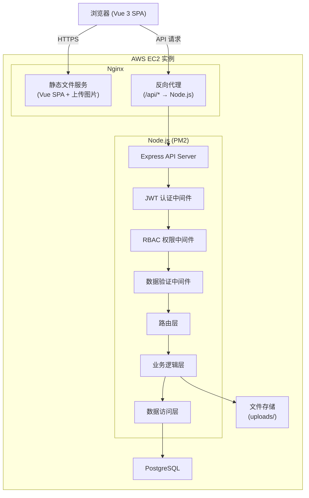
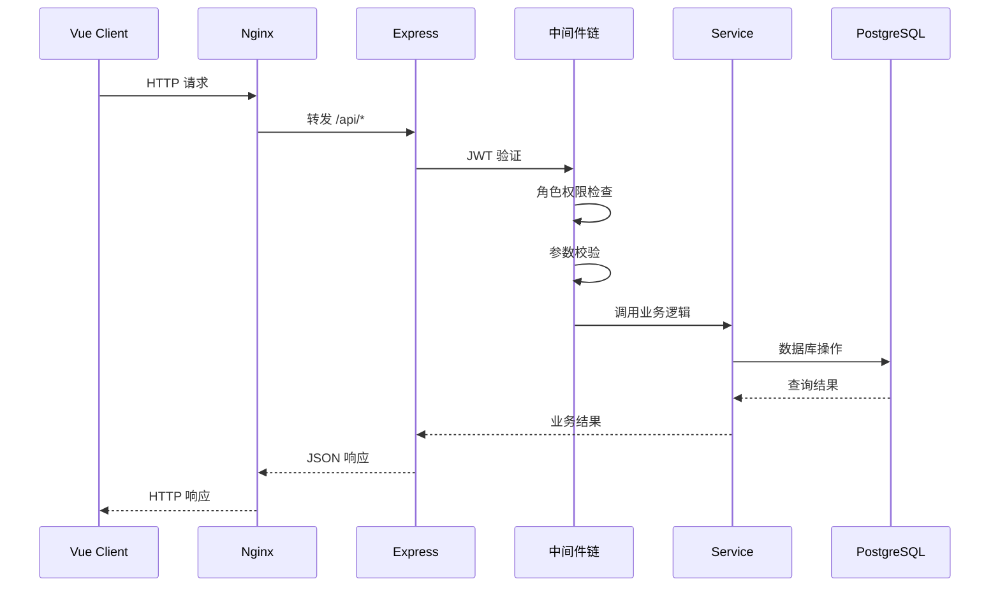
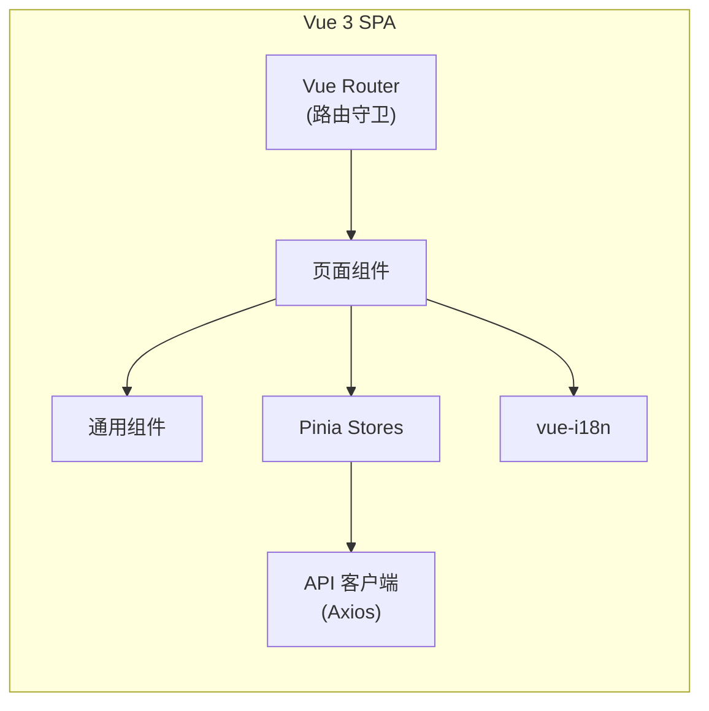
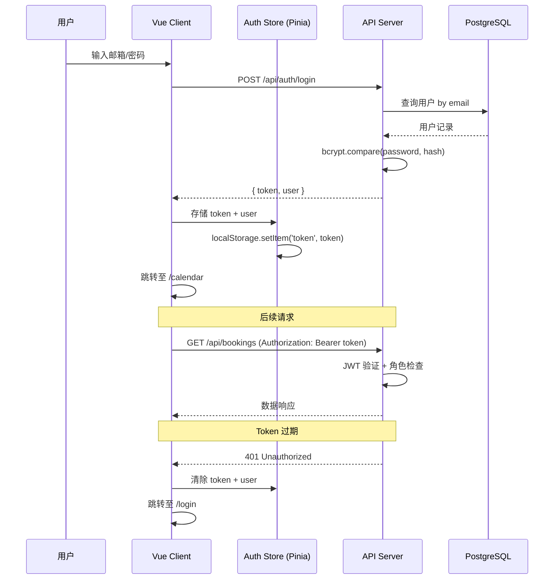
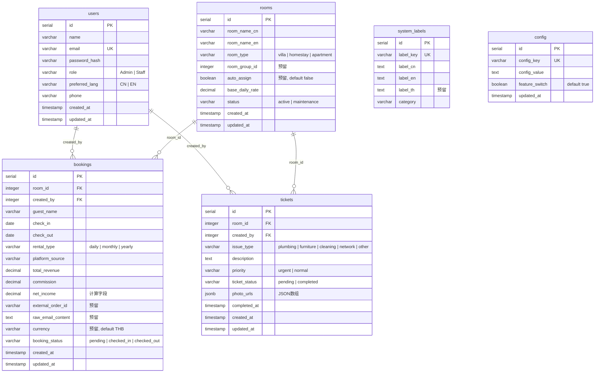
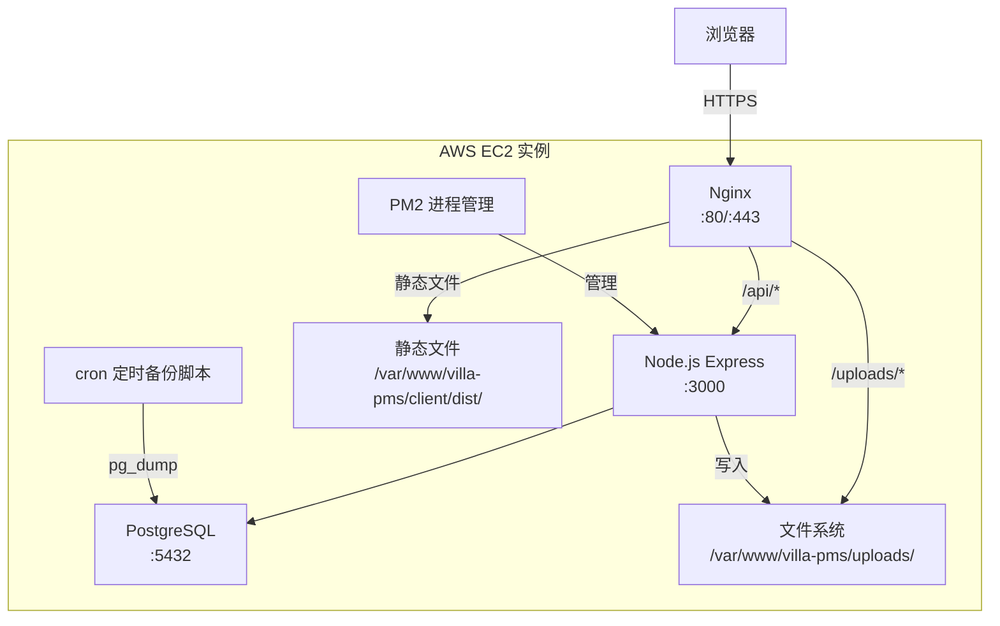

# 技术设计文档：泰国别墅物业管理系统（Villa PMS）

## 概述（Overview）

Villa PMS 是一套面向泰国清迈/普吉地区别墅物业管理的 Web 应用系统，管理 17 个物业单元。系统采用前后端分离架构：Vue 3 + Vite 构建 SPA 前端，Node.js + Express 提供 RESTful API 后端，PostgreSQL 作为持久化存储，部署于 AWS EC2 + Nginx + PM2。

系统核心功能包括：房态日历仪表盘、订单管理（含日期冲突检测和状态流转）、工单维修管理、财务报表（多维度聚合 + CSV 导出）、房源管理、用户管理与 RBAC 权限控制、国际化双语支持（中/英，预留泰语）、系统配置管理。

### 关键设计决策

| 决策 | 选择 | 理由 |
|------|------|------|
| 前端框架 | Vue 3 + Vite | 轻量、生态成熟、Composition API 适合中型项目 |
| 状态管理 | Pinia | Vue 3 官方推荐，TypeScript 友好 |
| 后端框架 | Express | 轻量灵活，社区生态丰富 |
| 数据库 | PostgreSQL | 强类型、JSON 支持好、适合结构化业务数据 |
| 认证方案 | JWT（自建） | 无外部依赖，完全可控 |
| 国际化 | vue-i18n | Vue 生态标准方案 |
| 测试框架 | Vitest + fast-check | Vitest 与 Vite 深度集成，fast-check 支持属性测试 |
| 部署方案 | EC2 + Nginx + PM2 | 成本可控，适合小规模物业管理场景 |

## 架构（Architecture）

### 系统架构图



### 请求处理流程



### 前端架构




## 组件与接口（Components and Interfaces）

### 后端目录结构

```
server/
├── src/
│   ├── app.js                  # Express 应用入口
│   ├── config/
│   │   └── index.js            # 环境变量配置
│   ├── middleware/
│   │   ├── auth.js             # JWT 认证中间件
│   │   ├── rbac.js             # 角色权限中间件
│   │   ├── validate.js         # 请求参数校验中间件
│   │   ├── rateLimiter.js      # 登录速率限制
│   │   └── errorHandler.js     # 全局错误处理
│   ├── routes/
│   │   ├── auth.js             # POST /api/auth/login, POST /api/auth/logout
│   │   ├── users.js            # CRUD /api/users
│   │   ├── rooms.js            # CRUD /api/rooms
│   │   ├── bookings.js         # CRUD /api/bookings
│   │   ├── tickets.js          # CRUD /api/tickets
│   │   ├── reports.js          # GET /api/reports/*
│   │   ├── config.js           # CRUD /api/config
│   │   └── labels.js           # GET /api/labels
│   ├── services/
│   │   ├── authService.js      # 认证业务逻辑
│   │   ├── userService.js      # 用户管理逻辑
│   │   ├── roomService.js      # 房源管理逻辑
│   │   ├── bookingService.js   # 订单管理逻辑（含日期冲突检测）
│   │   ├── ticketService.js    # 工单管理逻辑
│   │   ├── reportService.js    # 报表聚合逻辑
│   │   └── configService.js    # 配置管理逻辑
│   ├── models/
│   │   └── db.js               # PostgreSQL 连接池 (pg)
│   ├── validators/
│   │   ├── bookingValidator.js # 订单字段验证规则
│   │   ├── roomValidator.js    # 房源字段验证规则
│   │   ├── ticketValidator.js  # 工单字段验证规则
│   │   └── userValidator.js    # 用户字段验证规则
│   ├── utils/
│   │   ├── logger.js           # 结构化日志 (winston)
│   │   ├── errors.js           # 自定义错误类
│   │   └── income.js           # 净收入计算工具
│   └── migrations/             # 数据库迁移脚本
│       ├── 001_create_users.sql
│       ├── 002_create_rooms.sql
│       ├── 003_create_bookings.sql
│       ├── 004_create_tickets.sql
│       ├── 005_create_system_labels.sql
│       ├── 006_create_config.sql
│       └── 007_create_indexes.sql
├── uploads/                    # 工单图片上传目录
├── scripts/
│   ├── seed.js                 # 初始数据（默认管理员 + 平台来源）
│   └── backup.sh               # PostgreSQL 备份脚本
├── package.json
└── .env.example
```

### 前端目录结构

```
client/
├── src/
│   ├── main.js                 # 应用入口
│   ├── App.vue                 # 根组件
│   ├── router/
│   │   └── index.js            # 路由定义 + 导航守卫
│   ├── stores/
│   │   ├── auth.js             # 认证状态
│   │   ├── booking.js          # 订单状态
│   │   ├── room.js             # 房源状态
│   │   ├── ticket.js           # 工单状态
│   │   └── app.js              # 全局状态（语言、配置）
│   ├── views/
│   │   ├── LoginView.vue       # 登录页
│   │   ├── CalendarView.vue    # 房态日历仪表盘
│   │   ├── BookingListView.vue # 订单列表
│   │   ├── BookingFormView.vue # 订单创建/编辑
│   │   ├── TicketListView.vue  # 工单列表
│   │   ├── TicketFormView.vue  # 工单创建
│   │   ├── RoomListView.vue    # 房源列表
│   │   ├── RoomFormView.vue    # 房源编辑
│   │   ├── ReportView.vue      # 财务报表
│   │   ├── ConfigView.vue      # 系统配置
│   │   ├── UserListView.vue    # 用户管理
│   │   ├── ProfileView.vue     # 个人中心
│   │   └── NotFoundView.vue    # 404 页面
│   ├── components/
│   │   ├── layout/
│   │   │   ├── AppSidebar.vue  # 侧边栏导航
│   │   │   ├── AppHeader.vue   # 顶部栏
│   │   │   └── AppLayout.vue   # 布局容器
│   │   ├── calendar/
│   │   │   ├── CalendarGrid.vue    # 日历网格
│   │   │   └── BookingPopover.vue  # 订单摘要浮层
│   │   ├── common/
│   │   │   ├── DataTable.vue       # 通用数据表格（排序+分页）
│   │   │   ├── FormField.vue       # 表单字段（含验证提示）
│   │   │   ├── ToastNotification.vue # Toast 通知
│   │   │   └── ConfirmDialog.vue   # 确认对话框
│   │   └── report/
│   │       └── ReportTable.vue     # 报表表格（含汇总行）
│   ├── composables/
│   │   ├── useAuth.js          # 认证相关逻辑
│   │   ├── useValidation.js    # 表单验证逻辑
│   │   └── usePagination.js    # 分页逻辑
│   ├── api/
│   │   └── client.js           # Axios 实例（拦截器 + 错误处理）
│   ├── i18n/
│   │   ├── index.js            # vue-i18n 配置
│   │   ├── zh-CN.json          # 中文语言包
│   │   └── en-US.json          # 英文语言包
│   └── assets/
│       └── styles/
│           └── main.css        # 全局样式 + 响应式断点
├── index.html
├── vite.config.js
└── package.json
```

### RESTful API 接口设计

#### 认证接口

| 方法 | 路径 | 权限 | 说明 |
|------|------|------|------|
| POST | `/api/auth/login` | 公开 | 登录，返回 JWT |
| POST | `/api/auth/logout` | 已认证 | 登出 |

**POST /api/auth/login**
```json
// 请求
{ "email": "string", "password": "string" }
// 响应 200
{ "token": "string", "user": { "id": "number", "name": "string", "role": "Admin|Staff", "preferred_lang": "CN|EN" } }
// 响应 401
{ "error_code": "INVALID_CREDENTIALS", "message": "string" }
```

#### 用户接口

| 方法 | 路径 | 权限 | 说明 |
|------|------|------|------|
| GET | `/api/users` | Admin | 用户列表 |
| POST | `/api/users` | Admin | 创建用户 |
| PUT | `/api/users/:id` | Admin | 更新用户 |
| GET | `/api/users/me` | 已认证 | 当前用户信息 |
| PUT | `/api/users/me` | 已认证 | 更新个人信息 |
| PUT | `/api/users/me/password` | 已认证 | 修改密码 |

#### 房源接口

| 方法 | 路径 | 权限 | 说明 |
|------|------|------|------|
| GET | `/api/rooms` | 已认证 | 房源列表 |
| POST | `/api/rooms` | Admin | 新增房源 |
| PUT | `/api/rooms/:id` | Admin | 编辑房源 |
| GET | `/api/rooms/:id` | 已认证 | 房源详情 |

#### 订单接口

| 方法 | 路径 | 权限 | 说明 |
|------|------|------|------|
| GET | `/api/bookings` | 已认证 | 订单列表（支持筛选、排序、分页） |
| POST | `/api/bookings` | 已认证 | 创建订单 |
| GET | `/api/bookings/:id` | 已认证 | 订单详情 |
| PUT | `/api/bookings/:id` | 已认证 | 编辑订单 |
| PATCH | `/api/bookings/:id/status` | 已认证 | 更新订单状态 |
| GET | `/api/bookings/calendar` | 已认证 | 日历视图数据（按月查询） |

**GET /api/bookings 查询参数**
```
?room_id=1&status=pending&platform=Airbnb&from=2024-01-01&to=2024-01-31&sort=check_in&order=asc&page=1&page_size=20
```

**GET /api/bookings 响应**
```json
{
  "data": [{ "id": 1, "room_id": 1, "guest_name": "string", "check_in": "date", "check_out": "date", "rental_type": "daily|monthly|yearly", "platform_source": "string", "total_revenue": "number", "commission": "number", "net_income": "number", "booking_status": "pending|checked_in|checked_out", "created_by": "number", "created_at": "datetime" }],
  "total": 100,
  "total_pages": 5,
  "page": 1,
  "page_size": 20
}
```

**POST /api/bookings 请求**
```json
{
  "room_id": 1,
  "guest_name": "string",
  "check_in": "2024-01-15",
  "check_out": "2024-01-20",
  "rental_type": "daily",
  "platform_source": "Airbnb",
  "total_revenue": 5000,
  "commission": 750,
  "booking_status": "pending"
}
```

**PATCH /api/bookings/:id/status 请求**
```json
{ "booking_status": "checked_in" }
```

#### 工单接口

| 方法 | 路径 | 权限 | 说明 |
|------|------|------|------|
| GET | `/api/tickets` | 已认证 | 工单列表（支持筛选） |
| POST | `/api/tickets` | 已认证 | 创建工单（multipart/form-data） |
| GET | `/api/tickets/:id` | 已认证 | 工单详情 |
| PATCH | `/api/tickets/:id/complete` | Admin | 标记工单完成 |

#### 报表接口

| 方法 | 路径 | 权限 | 说明 |
|------|------|------|------|
| GET | `/api/reports/by-room` | Admin | 按房源聚合 |
| GET | `/api/reports/by-rental-type` | Admin | 按租期类型聚合 |
| GET | `/api/reports/by-platform` | Admin | 按平台来源聚合 |
| GET | `/api/reports/by-month` | Admin | 按月份聚合 |
| GET | `/api/reports/export` | Admin | 导出 CSV |

**GET /api/reports/export 查询参数**
```
?dimension=room|rental_type|platform|month&granularity=weekly|monthly&from=2024-01-01&to=2024-12-31
```

#### 配置接口

| 方法 | 路径 | 权限 | 说明 |
|------|------|------|------|
| GET | `/api/config` | Admin | 配置列表 |
| POST | `/api/config` | Admin | 新增配置 |
| PUT | `/api/config/:id` | Admin | 更新配置 |

#### 标签接口

| 方法 | 路径 | 权限 | 说明 |
|------|------|------|------|
| GET | `/api/labels` | 已认证 | 获取所有多语言标签 |

### 前端路由设计

```javascript
const routes = [
  { path: '/login', name: 'Login', component: LoginView, meta: { public: true } },
  {
    path: '/',
    component: AppLayout,
    meta: { requiresAuth: true },
    children: [
      { path: '', redirect: '/calendar' },
      { path: 'calendar', name: 'Calendar', component: CalendarView },
      { path: 'bookings', name: 'BookingList', component: BookingListView },
      { path: 'bookings/new', name: 'BookingCreate', component: BookingFormView },
      { path: 'bookings/:id', name: 'BookingDetail', component: BookingFormView },
      { path: 'tickets', name: 'TicketList', component: TicketListView },
      { path: 'tickets/new', name: 'TicketCreate', component: TicketFormView },
      { path: 'tickets/:id', name: 'TicketDetail', component: TicketFormView },
      { path: 'rooms', name: 'RoomList', component: RoomListView, meta: { role: 'Admin' } },
      { path: 'rooms/:id', name: 'RoomEdit', component: RoomFormView, meta: { role: 'Admin' } },
      { path: 'reports', name: 'Reports', component: ReportView, meta: { role: 'Admin' } },
      { path: 'config', name: 'Config', component: ConfigView, meta: { role: 'Admin' } },
      { path: 'users', name: 'UserList', component: UserListView, meta: { role: 'Admin' } },
      { path: 'profile', name: 'Profile', component: ProfileView },
    ]
  },
  { path: '/:pathMatch(.*)*', name: 'NotFound', component: NotFoundView }
]
```

**路由守卫逻辑：**
1. 未认证用户访问受保护路由 → 重定向至 `/login`
2. Staff 用户访问 `meta.role === 'Admin'` 路由 → 重定向至 `/calendar`
3. 已认证用户访问 `/login` → 重定向至 `/calendar`

### 认证流程



### 核心业务逻辑

#### 订单日期冲突检测

```javascript
// bookingService.js
async function checkDateConflict(roomId, checkIn, checkOut, excludeBookingId = null) {
  // SQL: 查找同一房源中日期范围重叠的订单
  // 重叠条件: existing.check_in < new.check_out AND existing.check_out > new.check_in
  // 编辑时排除当前订单自身: AND id != excludeBookingId
  const query = `
    SELECT id FROM bookings
    WHERE room_id = $1
      AND check_in < $3
      AND check_out > $2
      ${excludeBookingId ? 'AND id != $4' : ''}
  `;
  // 返回冲突订单列表
}
```

#### 订单状态流转

```javascript
// 合法状态转换映射
const STATUS_TRANSITIONS = {
  pending: ['checked_in'],
  checked_in: ['checked_out'],
  checked_out: []  // 终态
};

function validateStatusTransition(currentStatus, newStatus) {
  const allowed = STATUS_TRANSITIONS[currentStatus];
  if (!allowed || !allowed.includes(newStatus)) {
    throw new AppError('INVALID_STATUS_TRANSITION', 400);
  }
}
```

#### 净收入计算

```javascript
// utils/income.js
function calculateNetIncome(totalRevenue, commission) {
  // 使用整数运算避免浮点精度问题
  // 将金额转为分（乘100），计算后再转回
  const revenueCents = Math.round(totalRevenue * 100);
  const commissionCents = Math.round(commission * 100);
  return (revenueCents - commissionCents) / 100;
}
```


## 数据模型（Data Models）

### ER 关系图



### 数据库表结构 DDL

#### users 表

```sql
CREATE TABLE users (
    id SERIAL PRIMARY KEY,
    name VARCHAR(100) NOT NULL,
    email VARCHAR(255) NOT NULL UNIQUE,
    password_hash VARCHAR(255) NOT NULL,
    role VARCHAR(10) NOT NULL CHECK (role IN ('Admin', 'Staff')),
    preferred_lang VARCHAR(5) NOT NULL DEFAULT 'CN' CHECK (preferred_lang IN ('CN', 'EN')),
    phone VARCHAR(20),
    created_at TIMESTAMP WITH TIME ZONE DEFAULT NOW(),
    updated_at TIMESTAMP WITH TIME ZONE DEFAULT NOW()
);
```

#### rooms 表

```sql
CREATE TABLE rooms (
    id SERIAL PRIMARY KEY,
    room_name_cn VARCHAR(100) NOT NULL,
    room_name_en VARCHAR(100) NOT NULL,
    room_type VARCHAR(20) NOT NULL CHECK (room_type IN ('villa', 'homestay', 'apartment')),
    room_group_id INTEGER,
    auto_assign BOOLEAN DEFAULT FALSE,
    base_daily_rate DECIMAL(10, 2) NOT NULL CHECK (base_daily_rate > 0),
    status VARCHAR(20) NOT NULL DEFAULT 'active' CHECK (status IN ('active', 'maintenance')),
    created_at TIMESTAMP WITH TIME ZONE DEFAULT NOW(),
    updated_at TIMESTAMP WITH TIME ZONE DEFAULT NOW()
);
```

#### bookings 表

```sql
CREATE TABLE bookings (
    id SERIAL PRIMARY KEY,
    room_id INTEGER NOT NULL REFERENCES rooms(id),
    created_by INTEGER NOT NULL REFERENCES users(id),
    guest_name VARCHAR(200) NOT NULL,
    check_in DATE NOT NULL,
    check_out DATE NOT NULL,
    rental_type VARCHAR(10) NOT NULL CHECK (rental_type IN ('daily', 'monthly', 'yearly')),
    platform_source VARCHAR(50) NOT NULL,
    total_revenue DECIMAL(12, 2) NOT NULL CHECK (total_revenue >= 0),
    commission DECIMAL(12, 2) NOT NULL DEFAULT 0 CHECK (commission >= 0),
    net_income DECIMAL(12, 2) NOT NULL,
    external_order_id VARCHAR(100),
    raw_email_content TEXT,
    currency VARCHAR(10) DEFAULT 'THB',
    booking_status VARCHAR(20) NOT NULL DEFAULT 'pending'
        CHECK (booking_status IN ('pending', 'checked_in', 'checked_out')),
    created_at TIMESTAMP WITH TIME ZONE DEFAULT NOW(),
    updated_at TIMESTAMP WITH TIME ZONE DEFAULT NOW(),
    CONSTRAINT check_dates CHECK (check_out > check_in),
    CONSTRAINT check_commission CHECK (commission <= total_revenue)
);

-- 性能索引
CREATE INDEX idx_bookings_room_dates ON bookings (room_id, check_in, check_out);
CREATE INDEX idx_bookings_status ON bookings (booking_status);
CREATE INDEX idx_bookings_platform ON bookings (platform_source);
CREATE INDEX idx_bookings_created_at ON bookings (created_at);
```

#### tickets 表

```sql
CREATE TABLE tickets (
    id SERIAL PRIMARY KEY,
    room_id INTEGER NOT NULL REFERENCES rooms(id),
    created_by INTEGER NOT NULL REFERENCES users(id),
    issue_type VARCHAR(20) NOT NULL CHECK (issue_type IN ('plumbing', 'furniture', 'cleaning', 'network', 'other')),
    description TEXT NOT NULL,
    priority VARCHAR(10) NOT NULL DEFAULT 'normal' CHECK (priority IN ('urgent', 'normal')),
    ticket_status VARCHAR(20) NOT NULL DEFAULT 'pending' CHECK (ticket_status IN ('pending', 'completed')),
    photo_urls JSONB DEFAULT '[]'::jsonb,
    completed_at TIMESTAMP WITH TIME ZONE,
    created_at TIMESTAMP WITH TIME ZONE DEFAULT NOW(),
    updated_at TIMESTAMP WITH TIME ZONE DEFAULT NOW()
);
```

#### system_labels 表

```sql
CREATE TABLE system_labels (
    id SERIAL PRIMARY KEY,
    label_key VARCHAR(100) NOT NULL UNIQUE,
    label_cn TEXT NOT NULL,
    label_en TEXT NOT NULL,
    label_th TEXT,
    category VARCHAR(50)
);
```

#### config 表

```sql
CREATE TABLE config (
    id SERIAL PRIMARY KEY,
    config_key VARCHAR(100) NOT NULL UNIQUE,
    config_value TEXT,
    feature_switch BOOLEAN DEFAULT TRUE,
    updated_at TIMESTAMP WITH TIME ZONE DEFAULT NOW()
);
```

### 枚举值定义

| 枚举 | 值 | 使用位置 |
|------|------|------|
| 用户角色 | `Admin`, `Staff` | users.role |
| 语言偏好 | `CN`, `EN` | users.preferred_lang |
| 房源类型 | `villa`, `homestay`, `apartment` | rooms.room_type |
| 房源状态 | `active`, `maintenance` | rooms.status |
| 租期类型 | `daily`, `monthly`, `yearly` | bookings.rental_type |
| 订单状态 | `pending`, `checked_in`, `checked_out` | bookings.booking_status |
| 平台来源 | `Airbnb`, `Agoda`, `Booking.com`, `Trip.com`, `途家`, `小猪`, `美团民宿`, `飞猪`, `Expedia`, `VRBO`, `直客`, `其他` | bookings.platform_source |
| 问题类型 | `plumbing`, `furniture`, `cleaning`, `network`, `other` | tickets.issue_type |
| 优先级 | `urgent`, `normal` | tickets.priority |
| 工单状态 | `pending`, `completed` | tickets.ticket_status |

### 部署架构



**Nginx 配置要点：**
- `/` → 服务 Vue SPA 静态文件，所有非 API/uploads 路径 fallback 到 `index.html`
- `/api/*` → 反向代理到 `http://localhost:3000`
- `/uploads/*` → 直接服务上传文件目录
- 设置 CORS 头，限制允许的域名
- 启用 gzip 压缩


## 正确性属性（Correctness Properties）

*属性（Property）是指在系统所有合法执行中都应成立的特征或行为——本质上是对系统应做什么的形式化陈述。属性是人类可读规格说明与机器可验证正确性保证之间的桥梁。*

### Property 1: JWT 令牌包含正确声明

*For any* 有效用户凭据（邮箱+密码），登录后返回的 JWT 令牌解码后应包含该用户的 id、role 和 preferred_lang，且与数据库中存储的值一致。

**Validates: Requirements 1.1**

### Property 2: 无效凭据被拒绝

*For any* 不存在的邮箱或错误的密码组合，登录请求应返回 401 状态码，且响应体不包含任何令牌信息。

**Validates: Requirements 1.2**

### Property 3: 无效/过期 JWT 被拒绝

*For any* 受保护的 API 端点，携带过期、篡改或缺失的 JWT 令牌发起请求，应返回 401 状态码。

**Validates: Requirements 1.3, 1.4, 13.1**

### Property 4: 密码 bcrypt 哈希存储

*For any* 新创建的用户，数据库中存储的 password_hash 应为有效的 bcrypt 哈希值，且原始密码不应出现在数据库中任何字段。

**Validates: Requirements 1.6**

### Property 5: RBAC 权限隔离

*For any* Staff 角色用户和任意管理员专属 API 端点（用户管理、财务报表、系统配置、工单完成），请求应返回 403 状态码。

**Validates: Requirements 2.4, 3.5, 7.5, 8.8, 9.5**

### Property 6: Staff 路由重定向

*For any* Staff 角色用户，通过 URL 直接访问管理员专属页面（reports、config、users），前端路由守卫应重定向至 /calendar。

**Validates: Requirements 3.3**

### Property 7: 实体创建/更新往返一致性

*For any* 有效的实体数据（用户、房源、订单、工单、配置项），创建或更新后再查询，返回的数据应与提交的数据在所有业务字段上等价。

**Validates: Requirements 2.1, 4.2, 6.2, 7.2, 9.2, 11.2**

### Property 8: 邮箱唯一性约束

*For any* 两个用户创建请求，如果使用相同的邮箱地址，第二个请求应被拒绝。

**Validates: Requirements 2.3**

### Property 9: 配置键唯一性约束

*For any* 两个配置项创建请求，如果使用相同的 config_key，第二个请求应被拒绝。

**Validates: Requirements 9.3**

### Property 10: 净收入计算正确性

*For any* 非负的 total_revenue 和 commission（且 commission ≤ total_revenue），calculateNetIncome(total_revenue, commission) 应等于 total_revenue - commission，且该计算是幂等的：对结果再次格式化和解析应产生等价数值。

**Validates: Requirements 6.3, 18.8**

### Property 11: 订单日期冲突检测

*For any* 同一房源的两个订单，如果日期范围存在重叠（A.check_in < B.check_out AND A.check_out > B.check_in），第二个订单的创建应被拒绝并返回 BOOKING_DATE_CONFLICT 错误。

**Validates: Requirements 6.4**

### Property 12: 订单编辑时日期冲突排除自身

*For any* 已存在的订单，编辑该订单时保持原有日期不变，日期冲突检测不应与自身冲突（即编辑应成功）。

**Validates: Requirements 6.10**

### Property 13: 订单状态流转合法性

*For any* 订单和任意状态转换请求，仅 pending→checked_in 和 checked_in→checked_out 的转换应成功，所有其他转换（如 pending→checked_out、checked_out→pending）应被拒绝并返回 INVALID_STATUS_TRANSITION 错误。

**Validates: Requirements 6.5, 6.6**

### Property 14: 订单筛选正确性

*For any* 订单集合和任意筛选条件组合（room_id、status、platform_source、日期范围），返回的每条订单都应满足所有指定的筛选条件。

**Validates: Requirements 6.1**

### Property 15: 平台来源枚举验证

*For any* 不属于 12 个预定义平台来源的字符串，创建订单时应被拒绝并返回 400 状态码。

**Validates: Requirements 6.9**

### Property 16: 输入数据验证

*For any* 违反约束的输入数据（退房日期 ≤ 入住日期、负数收入/佣金、无效的房源类型枚举、无效的问题类型枚举、空房源名称、非正数日基础房价），API 应返回 400 状态码和具体的字段级错误信息。

**Validates: Requirements 18.1, 18.2, 18.4, 18.5, 4.5**

### Property 17: 财务报表聚合正确性

*For any* 订单集合和任意分组维度（房源、租期类型、平台来源、月份），每个分组的 total_revenue、total_commission、total_net_income 应分别等于该分组内所有订单对应字段的求和值。

**Validates: Requirements 8.1, 8.2, 8.3, 8.4, 8.5**

### Property 18: CSV 导出数据完整性

*For any* 报表数据，导出的 CSV 文件解析后应包含与报表 API 返回的相同数据行和数值。

**Validates: Requirements 8.6**

### Property 19: 分页正确性

*For any* 订单列表查询，返回的数据条数不超过 page_size，且 total_pages 应等于 ceil(total / page_size)。

**Validates: Requirements 17.1, 17.2**

### Property 20: 排序正确性

*For any* 排序字段（check_in、check_out、created_at、total_revenue）和排序方向（asc/desc），返回的订单列表应按指定字段和方向有序排列。

**Validates: Requirements 17.4**

### Property 21: 统一错误响应格式

*For any* API 错误响应（4xx 或 5xx），响应体应包含 error_code（字符串）和 message（字符串）字段，且 500 错误不应暴露内部错误详情。

**Validates: Requirements 14.1, 14.4, 13.7**

### Property 22: 结构化日志完整性

*For any* API 请求，系统应生成包含 timestamp、request_path、user_id（如已认证）和 response_status_code 的结构化日志条目。

**Validates: Requirements 13.6**

### Property 23: 密码修改验证

*For any* 用户密码修改请求，提供正确的旧密码时应成功且新密码可用于登录；提供错误的旧密码时应返回 400 状态码。

**Validates: Requirements 11.3, 11.4**

### Property 24: 语言偏好持久化

*For any* 用户语言切换操作，切换后查询用户信息应返回更新后的 preferred_lang 值。

**Validates: Requirements 10.3**

### Property 25: SQL 注入防护

*For any* 包含 SQL 注入模式的用户输入（如 `'; DROP TABLE users; --`），系统应安全处理而不执行恶意 SQL，数据库状态应保持不变。

**Validates: Requirements 13.4**

### Property 26: 工单完成记录时间戳

*For any* 待处理工单，管理员标记完成后，ticket_status 应为 completed 且 completed_at 应为非空时间戳。

**Validates: Requirements 7.4**


## 错误处理（Error Handling）

### 后端错误处理架构

```javascript
// utils/errors.js - 自定义错误类
class AppError extends Error {
  constructor(errorCode, statusCode, message, details = null) {
    super(message);
    this.errorCode = errorCode;
    this.statusCode = statusCode;
    this.details = details;
  }
}
```

### 统一错误响应格式

```json
{
  "error_code": "BOOKING_DATE_CONFLICT",
  "message": "入住日期与已有订单冲突",
  "details": { "conflicting_booking_id": 42 }
}
```

### 业务错误码清单

| 错误码 | HTTP 状态码 | 说明 |
|--------|------------|------|
| `INVALID_CREDENTIALS` | 401 | 邮箱或密码错误 |
| `TOKEN_EXPIRED` | 401 | JWT 令牌过期 |
| `TOKEN_INVALID` | 401 | JWT 令牌无效 |
| `FORBIDDEN` | 403 | 无权限访问 |
| `RATE_LIMIT_EXCEEDED` | 429 | 登录尝试次数超限 |
| `BOOKING_DATE_CONFLICT` | 409 | 订单日期冲突 |
| `INVALID_STATUS_TRANSITION` | 400 | 非法状态流转 |
| `DUPLICATE_EMAIL` | 409 | 邮箱已存在 |
| `DUPLICATE_CONFIG_KEY` | 409 | 配置键已存在 |
| `VALIDATION_ERROR` | 400 | 数据验证失败 |
| `INVALID_OLD_PASSWORD` | 400 | 旧密码不正确 |
| `RESOURCE_NOT_FOUND` | 404 | 资源不存在 |
| `INTERNAL_ERROR` | 500 | 服务器内部错误 |

### 全局错误处理中间件

```javascript
// middleware/errorHandler.js
function errorHandler(err, req, res, next) {
  // 记录结构化日志
  logger.error({
    timestamp: new Date().toISOString(),
    path: req.path,
    method: req.method,
    userId: req.user?.id,
    error: err.message,
    stack: err.stack
  });

  if (err instanceof AppError) {
    return res.status(err.statusCode).json({
      error_code: err.errorCode,
      message: err.message,
      details: err.details
    });
  }

  // 未知错误：返回通用消息，不暴露内部详情
  res.status(500).json({
    error_code: 'INTERNAL_ERROR',
    message: 'An unexpected error occurred'
  });
}
```

### 前端错误处理

```javascript
// api/client.js - Axios 响应拦截器
apiClient.interceptors.response.use(
  response => response,
  error => {
    if (!error.response) {
      // 网络错误
      showToast(t('error.network_failure'));
      return Promise.reject(error);
    }

    const { status, data } = error.response;

    if (status === 401) {
      // 清除认证状态，跳转登录
      authStore.logout();
      router.push('/login');
    } else {
      // 显示业务错误消息
      showToast(data.message || t('error.unknown'));
    }

    return Promise.reject(error);
  }
);
```

### 数据验证错误响应示例

```json
{
  "error_code": "VALIDATION_ERROR",
  "message": "数据验证失败",
  "details": {
    "fields": {
      "check_out": "退房日期必须晚于入住日期",
      "total_revenue": "总收入不能为负数"
    }
  }
}
```

## 测试策略（Testing Strategy）

### 测试框架选型

| 工具 | 用途 |
|------|------|
| Vitest | 单元测试 + 集成测试运行器 |
| fast-check | 属性测试（Property-Based Testing） |
| supertest | HTTP API 集成测试 |

### 双重测试方法

本系统采用单元测试与属性测试互补的双重测试策略：

- **单元测试**：验证具体示例、边界情况和错误条件
- **属性测试**：验证跨所有输入的通用属性

两者互补：单元测试捕获具体 bug，属性测试验证通用正确性。

### 属性测试配置要求

- 使用 `fast-check` 库（不自行实现属性测试框架）
- 每个属性测试最少运行 **100 次迭代**
- 每个属性测试必须用注释引用设计文档中的属性编号
- 注释格式：`// Feature: villa-pms-rebuild, Property {number}: {property_text}`
- 每个正确性属性由**单个**属性测试实现

### 属性测试覆盖计划

| 属性编号 | 属性名称 | 测试文件 | 生成器策略 |
|----------|----------|----------|------------|
| Property 1 | JWT 令牌包含正确声明 | `auth.property.test.js` | 生成随机用户（角色、语言偏好） |
| Property 2 | 无效凭据被拒绝 | `auth.property.test.js` | 生成随机邮箱/密码组合 |
| Property 3 | 无效/过期 JWT 被拒绝 | `auth.property.test.js` | 生成随机篡改/过期令牌 |
| Property 4 | 密码 bcrypt 哈希存储 | `auth.property.test.js` | 生成随机密码字符串 |
| Property 5 | RBAC 权限隔离 | `rbac.property.test.js` | 生成 Staff 用户 × 管理员端点组合 |
| Property 7 | 实体往返一致性 | `entity.property.test.js` | 生成随机实体数据 |
| Property 8 | 邮箱唯一性 | `user.property.test.js` | 生成随机邮箱 |
| Property 10 | 净收入计算 | `income.property.test.js` | 生成随机 total_revenue 和 commission |
| Property 11 | 日期冲突检测 | `booking.property.test.js` | 生成随机日期范围对 |
| Property 12 | 编辑时排除自身 | `booking.property.test.js` | 生成随机订单 + 编辑数据 |
| Property 13 | 状态流转合法性 | `booking.property.test.js` | 生成随机状态转换对 |
| Property 14 | 订单筛选正确性 | `booking.property.test.js` | 生成随机订单集 + 筛选条件 |
| Property 15 | 平台来源枚举 | `booking.property.test.js` | 生成随机字符串 |
| Property 16 | 输入数据验证 | `validation.property.test.js` | 生成违反各约束的随机输入 |
| Property 17 | 报表聚合正确性 | `report.property.test.js` | 生成随机订单集 |
| Property 18 | CSV 导出完整性 | `report.property.test.js` | 生成随机报表数据 |
| Property 19 | 分页正确性 | `pagination.property.test.js` | 生成随机 page/page_size |
| Property 20 | 排序正确性 | `pagination.property.test.js` | 生成随机订单集 + 排序参数 |
| Property 21 | 统一错误格式 | `error.property.test.js` | 生成各类错误场景 |
| Property 23 | 密码修改验证 | `auth.property.test.js` | 生成随机旧密码/新密码 |
| Property 25 | SQL 注入防护 | `security.property.test.js` | 生成包含 SQL 注入模式的字符串 |
| Property 26 | 工单完成时间戳 | `ticket.property.test.js` | 生成随机工单 |

### 单元测试覆盖计划

单元测试聚焦于具体示例和边界情况：

| 测试场景 | 测试文件 | 类型 |
|----------|----------|------|
| 默认管理员账户创建 | `seed.test.js` | 示例 |
| 登录速率限制（10次后429） | `rateLimiter.test.js` | 示例 |
| CORS 响应头验证 | `cors.test.js` | 示例 |
| 数据库表结构存在性 | `migration.test.js` | 示例 |
| 日历默认展示当前月份 | `calendar.test.js` | 示例 |
| CSV 导出周/月粒度 | `report.test.js` | 示例 |
| 图片上传和 URL 可访问性 | `ticket.test.js` | 集成 |
| 登出清除 localStorage | `auth.test.js` | 示例 |
| 401 响应自动跳转登录 | `interceptor.test.js` | 示例 |

### 测试目录结构

```
server/
├── tests/
│   ├── property/           # 属性测试
│   │   ├── auth.property.test.js
│   │   ├── rbac.property.test.js
│   │   ├── booking.property.test.js
│   │   ├── income.property.test.js
│   │   ├── validation.property.test.js
│   │   ├── report.property.test.js
│   │   ├── pagination.property.test.js
│   │   ├── error.property.test.js
│   │   ├── security.property.test.js
│   │   ├── entity.property.test.js
│   │   ├── ticket.property.test.js
│   │   └── user.property.test.js
│   ├── unit/               # 单元测试
│   │   ├── seed.test.js
│   │   ├── rateLimiter.test.js
│   │   └── report.test.js
│   └── integration/        # 集成测试
│       ├── auth.test.js
│       ├── booking.test.js
│       └── ticket.test.js
client/
├── tests/
│   ├── unit/
│   │   ├── auth.test.js
│   │   ├── calendar.test.js
│   │   └── interceptor.test.js
│   └── property/
│       └── routing.property.test.js
```

### 属性测试示例

```javascript
// server/tests/property/income.property.test.js
import { describe, it } from 'vitest';
import * as fc from 'fast-check';
import { calculateNetIncome } from '../../src/utils/income.js';

describe('净收入计算属性测试', () => {
  // Feature: villa-pms-rebuild, Property 10: 净收入计算正确性
  it('对任意非负 revenue 和 commission，net_income = revenue - commission', () => {
    fc.assert(
      fc.property(
        fc.double({ min: 0, max: 1_000_000, noNaN: true }),
        fc.double({ min: 0, max: 1_000_000, noNaN: true }),
        (revenue, commission) => {
          fc.pre(commission <= revenue);
          const result = calculateNetIncome(revenue, commission);
          const expected = Math.round((revenue - commission) * 100) / 100;
          return Math.abs(result - expected) < 0.01;
        }
      ),
      { numRuns: 100 }
    );
  });
});
```

```javascript
// server/tests/property/booking.property.test.js
import { describe, it } from 'vitest';
import * as fc from 'fast-check';
import { validateStatusTransition } from '../../src/services/bookingService.js';

describe('订单状态流转属性测试', () => {
  // Feature: villa-pms-rebuild, Property 13: 订单状态流转合法性
  it('仅合法状态转换应成功', () => {
    const statuses = ['pending', 'checked_in', 'checked_out'];
    const validTransitions = new Set(['pending->checked_in', 'checked_in->checked_out']);

    fc.assert(
      fc.property(
        fc.constantFrom(...statuses),
        fc.constantFrom(...statuses),
        (from, to) => {
          const key = `${from}->${to}`;
          const isValid = validTransitions.has(key);
          try {
            validateStatusTransition(from, to);
            return isValid;
          } catch {
            return !isValid;
          }
        }
      ),
      { numRuns: 100 }
    );
  });
});
```
